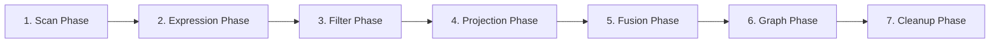
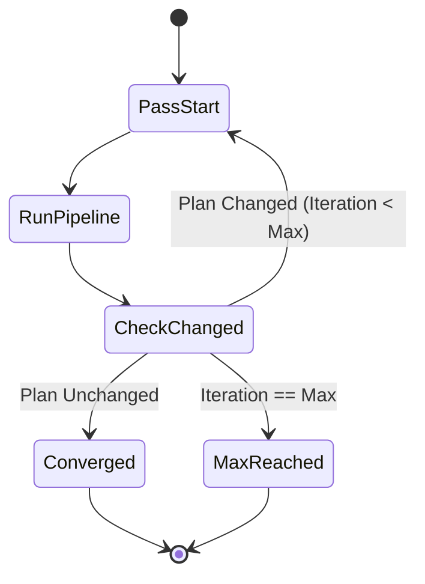

# Optimization Pipeline & Scheduler

## Overview

The `OptimizationPipeline` and `OptimizationScheduler` form the execution engine of the `PlannerOptimizer`.

The pipeline executes optimization phases in topological dependency order. Within each phase, rules are evaluated according to their priority.

The scheduler wraps the pipeline in a fixed-point iteration loop, continuing passes until no rules produce changes or `max_iterations` (default 10) is reached.

---

## Phase Execution Sequence

---

## Convergence Detection

Convergence is achieved when `plan.operators` at iteration `k` is identical to `plan.operators` at iteration `k-1`.

