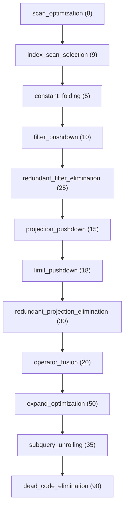

# Optimization Rules Reference

## 13 Standard Optimization Rules

The Planner Optimizer includes 13 production-ready rules:

| Rule ID | Category | Priority | Description |
|---------|----------|----------|-------------|
| `scan_optimization` | Scan | 8 | Converts generic `scan` to `index_scan` when index parameter is present. |
| `index_scan_selection` | Scan | 9 | Promotes `index_scan` to `composite_index_scan` for multiple indexed fields. |
| `constant_folding` | Expression | 5 | Folds constant expressions in operator parameters (e.g. `1 == 1` -> `true`). |
| `filter_pushdown` | Filter | 10 | Pushes filter operators down past projections, expands, or joins. |
| `redundant_filter_elimination` | Filter | 25 | Eliminates filters with `true` or empty predicates. |
| `projection_pushdown` | Projection | 15 | Pushes projections down past sorts or limits. |
| `limit_pushdown` | Limit | 18 | Pushes `limit` operators past projections to cut off work earlier. |
| `redundant_projection_elimination` | Projection | 30 | Removes `*` identity projections or duplicate consecutive projections. |
| `operator_fusion` | Fusion | 20 | Fuses adjacent compatible operators (e.g. merging consecutive filters). |
| `subquery_unrolling` | Subquery | 35 | Inlines simple inline subqueries into the main physical plan. |
| `join_reordering` | Join | 40 | Reorders joins using heuristics (placeholder for future cost model integration). |
| `expand_optimization` | Graph | 50 | Converts generic `expand` operators to `indexed_expand` when hints exist. |
| `dead_code_elimination` | Cleanup | 90 | Truncates unreachable operators following false filters or zero limits. |

---

## Rule Dependency DAG

