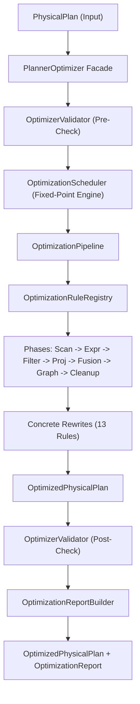

# Planner Optimizer Architecture

## Overview

The `PlannerOptimizer` is a core subsystem of the DevBrain Graph Query Engine. It consumes a validated `PhysicalPlan` and produces an `OptimizedPhysicalPlan` that is semantically equivalent but optimized for execution.

The Optimizer is pure, deterministic, and modular. It does NOT execute queries, access the `GraphView`, or perform cost estimation. Instead, it relies on rule-based rewrites, topological phase scheduling, and fixed-point convergence to optimize plan structure.

---

## Architectural Pipeline



---

## Core Components

- **`PlannerOptimizer`**: High-level entry point exposing `optimize()` and `optimize_with_report()`.
- **`OptimizationScheduler`**: Drives pipeline passes until fixed-point convergence or maximum iteration limit is reached.
- **`OptimizationPipeline`**: Executes phases in topological order and applies rules within each phase.
- **`OptimizationRuleRegistry`**: Thread-safe singleton registry for registering, toggling, and ordering rules and phases.
- **`OptimizationRule`**: Abstract base class for all frozen, pure optimization rewrite rules.
- **`OptimizationDiagnostics`**: Thread-safe diagnostics tracking applied, skipped, and rejected rules.
- **`OptimizationMetrics`**: Structural counters tracking operators removed, merged, depth reductions, and complexity estimates.
- **`OptimizerValidator`**: Validates invariant constraints between before and after plans.

---

## Usage Example

```python
from graph_query_engine.optimizer import PlannerOptimizer, PhysicalPlan

plan = PhysicalPlan(operators=[
    {"type": "scan", "params": {"index": "idx_name"}},
    {"type": "filter", "params": {"pred": "1 == 1"}},
    {"type": "filter", "params": {"pred": "age > 30"}},
])

optimizer = PlannerOptimizer()
optimized_plan, report = optimizer.optimize_with_report(plan)

print("Optimized Operators:", optimized_plan.operators)
print("Applied Rules:", [rule.name for rule in report.applied_rules])
```
