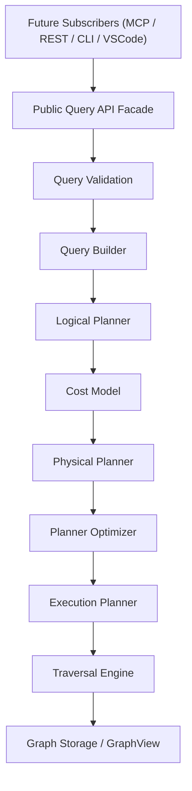

# Public Query API Architecture

The **Public Query API** is the official entry point into the DevBrain Graph Query Engine.

It provides an engineering-centric facade that hides internal planner, execution plan, and traversal mechanics from external consumers (such as future REST APIs, MCP Servers, CLI, and VS Code extensions).

## Key Architectural Principles

1. **Facade Pattern**: Callers interact exclusively with `QueryEngine` or `QuerySession` and never directly with `LogicalPlanner`, `PhysicalPlanner`, `ExecutionPlan`, or `TraversalEngine`.
2. **Engineering Concepts**: Exposes operations like `find_callers()`, `find_dependencies()`, `lookup_class()`, and `search_symbols()` rather than graph theory algorithms (`bfs`, `dfs`, `adjacency`).
3. **100% Immutability**: All request and response structures (`QueryRequest`, `QueryResponse`, `QueryResult`, `QueryContext`, `QueryOptions`) use frozen Pydantic models.
4. **Clean Layering**: Positioned at level `110` in `dependency_rules.py`, consuming lower pipeline layers downwards without any upward leakage.
