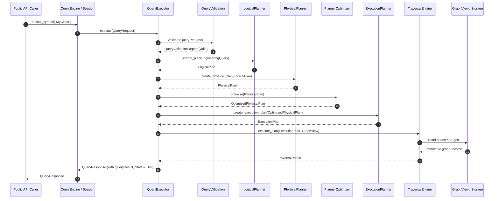

# Query Execution Pipeline Architecture

Every request submitted to `QueryEngine` or `QuerySession` flows through a multi-stage internal compilation and traversal pipeline.

## Internal Pipeline Stages

1. **Request Validation (`QueryValidation`)**: Validates depth limits, timeout, target repository ID, and operation parameters.
2. **AST Construction (`EngineeringQuery`)**: Converts the high-level request into a canonical immutable query AST.
3. **Logical Planning (`LogicalPlanner`)**: Lowers AST into execution-independent logical operator trees.
4. **Physical Strategy Selection (`PhysicalPlanner`)**: Chooses index lookup strategies, join algorithms, and graph expansion physical operators.
5. **Rule Optimization (`PlannerOptimizer`)**: Optimizes the physical plan using rule-based transformations.
6. **Execution Partitioning (`ExecutionPlanner`)**: Decomposes physical trees into executable pipeline stages and dependency graphs (`ExecutionPlan`).
7. **Graph Traversal (`TraversalEngine`)**: Executes graph algorithms against `GraphView` without AI or LLM dependency.
8. **Result Adaptation (`QueryResult`)**: Translates raw `TraversalResult` into clean engineering objects (`nodes`, `edges`, `paths`, `records`).
