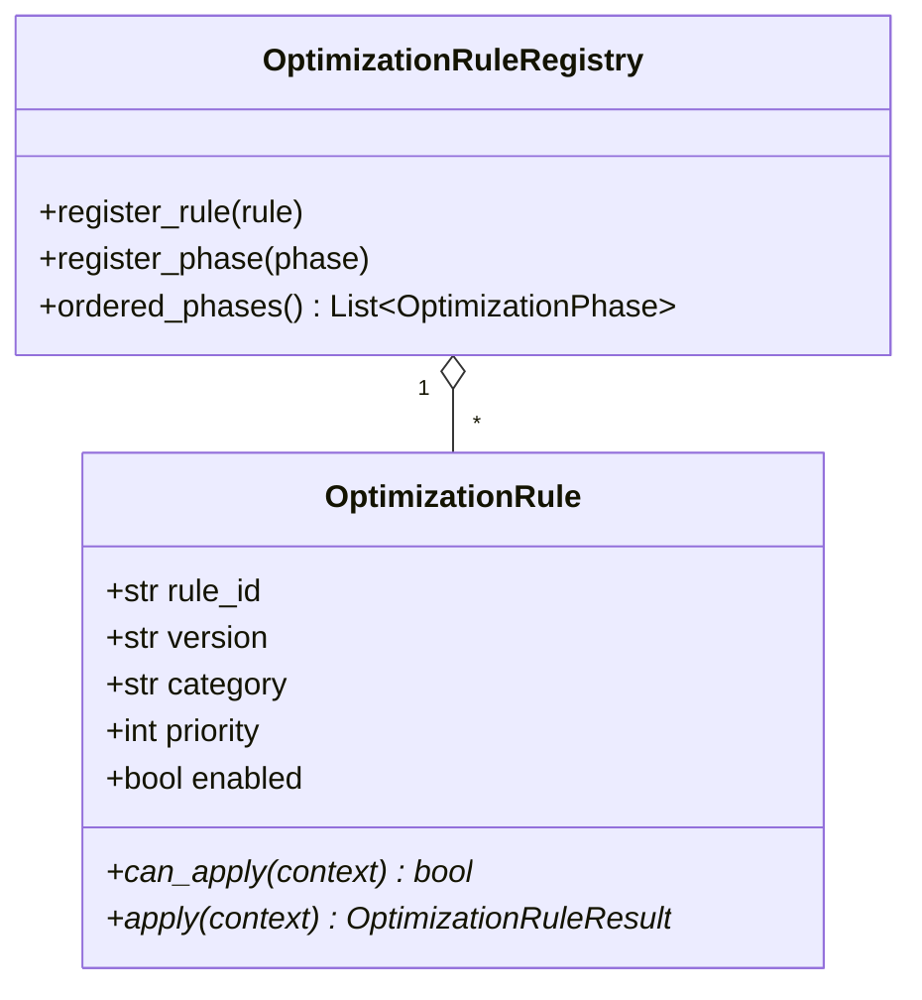

# Rule Engine Infrastructure

## Overview

The Rule Engine infrastructure consists of:
- `OptimizationRule`: Abstract base class for rewrite rules.
- `OptimizationRuleContext`: Container carrying plan state, statistics, and diagnostics.
- `OptimizationRuleResult`: Return value of rule applications.
- `OptimizationRuleRegistry`: Thread-safe singleton for rule registration, dependency ordering, and phase scheduling.

