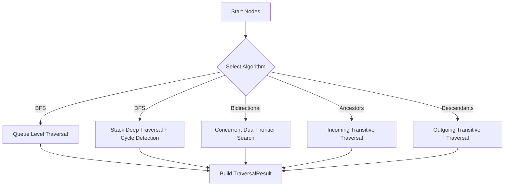

# Traversal Algorithms Reference

## Overview

The Traversal Engine features 10 production-ready graph algorithms operating on `GraphView`:

| Algorithm Name | Class | Description |
|----------------|-------|-------------|
| `BreadthFirstSearch` | `BreadthFirstSearch` | Level-by-level BFS with depth limits, node/edge limits, and path reconstruction. |
| `DepthFirstSearch` | `DepthFirstSearch` | Stack-based DFS with active recursion stack cycle detection. |
| `BidirectionalSearch` | `BidirectionalSearch` | Concurrent forward/backward BFS meeting at intersection node. |
| `ShortestPath` | `ShortestPath` | Unweighted shortest path discovery between source and target. |
| `ReachabilityAnalysis` | `ReachabilityAnalysis` | Transitive reachability analysis across target node sets. |
| `ConnectedComponents` | `ConnectedComponents` | Discovers weakly connected components across repository scope. |
| `TopologicalTraversal` | `TopologicalTraversal` | Kahn's algorithm for linear ordering of DAG dependencies. |
| `CycleDetection` | `CycleDetection` | Identifies cycle back-edges and extracts cycle subpaths. |
| `AncestorDiscovery` | `AncestorDiscovery` | Transitive incoming edge traversal for upstream callers/dependencies. |
| `DescendantDiscovery` | `DescendantDiscovery` | Transitive outgoing edge traversal for downstream callees/dependents. |
| `NeighborhoodExpansion` | `NeighborhoodExpansion` | Multi-hop k-neighborhood expansion. |

---

## Algorithm Flow Diagram

