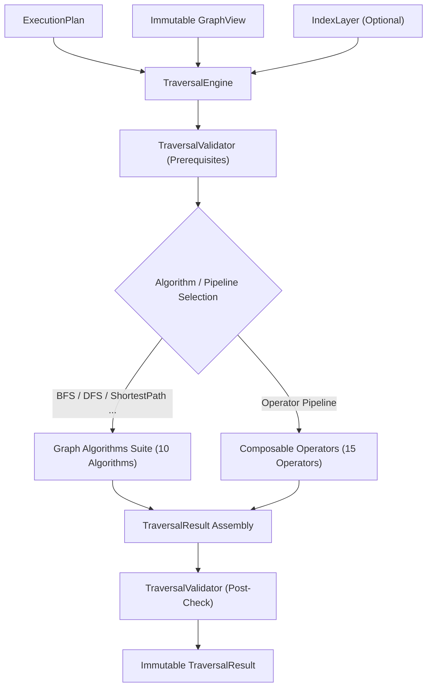

# Traversal Engine Architecture

## Overview

The `TraversalEngine` is the execution backbone for graph traversals in the DevBrain Graph Query Engine. It translates an `ExecutionPlan` or direct traversal parameters into graph algorithm invocations and composable operator pipelines against an immutable `GraphView`.

The Traversal Engine is purely graph-algorithmic: it performs NO AI reasoning, calls NO LLMs, and generates NO natural-language explanations.

---

## Architectural Pipeline

---

## Key Features

- **10 Core Graph Algorithms**: BFS, DFS, Bidirectional Search, Unweighted Shortest Path, Reachability Analysis, Connected Components, Topological Traversal, Cycle Detection, Ancestors Discovery, Descendants Discovery, Neighborhood Expansion.
- **15 Composable Operators**: NodeScan, IndexLookup, NeighborExpand, EdgeFilter, PathExpand, TraversalMerge, TraversalUnion, TraversalIntersection, TraversalLimit, TraversalSort, TraversalDeduplicate, TraversalAggregate, TraversalProject, TraversalCollect, TraversalResultBuilder.
- **100% Immutability**: Built on frozen Pydantic models (`ConfigDict(frozen=True)`).
- **Diagnostics & Metrics**: Thread-safe telemetry for node/edge visit counts, max depth, pruning statistics, and execution duration.
