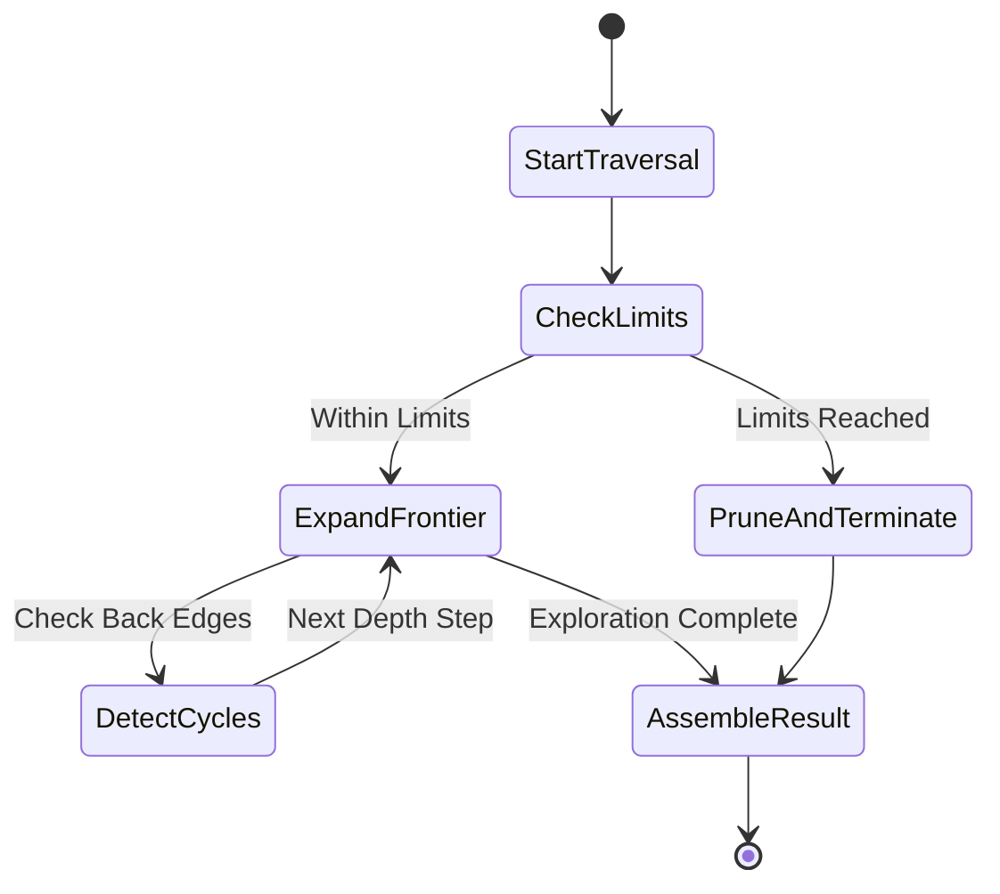

# Traversal Execution & Limits

## Overview

The `TraversalEngine` executes graph traversals within explicit safety boundaries defined by `TraversalLimits`:

- `max_depth`: Maximum depth of graph exploration (default 100).
- `max_nodes`: Maximum total nodes visited (default 10,000).
- `max_edges`: Maximum total edges traversed (default 50,000).
- `timeout_ms`: Execution timeout limit (default 30,000 ms).
- `direction`: Default edge direction (`OUTGOING`, `INCOMING`, `BOTH`).

