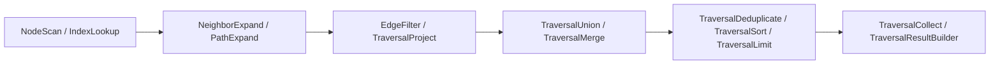

# Traversal Operators Reference

## Overview

The Traversal Engine includes 15 composable execution operators that can be chained into a `TraversalPipeline`:

## Operator Summary

1. `NodeScanOperator`: Scans all nodes or nodes of a specific type.
2. `IndexLookupOperator`: Uses `IndexLayer` for O(1) key/type lookup.
3. `NeighborExpandOperator`: Expands 1-hop neighbors (OUTGOING, INCOMING, BOTH).
4. `EdgeFilterOperator`: Filters edge traversals by edge type or attributes.
5. `PathExpandOperator`: Multi-hop path expansion up to depth limits.
6. `TraversalMergeOperator`: Merges secondary node streams while preserving order.
7. `TraversalUnionOperator`: Set union of node streams.
8. `TraversalIntersectionOperator`: Set intersection of node streams.
9. `TraversalLimitOperator`: Truncates stream to maximum node limit.
10. `TraversalSortOperator`: Sorts nodes lexicographically or by custom order.
11. `TraversalDeduplicateOperator`: Removes duplicates while preserving order.
12. `TraversalAggregateOperator`: Computes stream summary metrics.
13. `TraversalProjectOperator`: Projects node IDs based on prefix or fields.
14. `TraversalCollectOperator`: Accumulates stream items into a list.
15. `TraversalResultBuilderOperator`: Assembles final `TraversalResult`.
