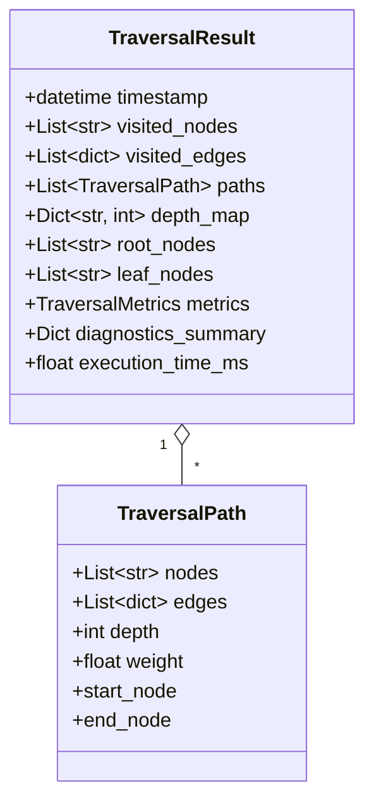

# Traversal Result Structure

## Overview

`TraversalResult` is the immutable return contract produced by `TraversalEngine`.

```mermaid
classDiagram
    class TraversalResult {
        +datetime timestamp
        +List~str~ visited_nodes
        +List~dict~ visited_edges
        +List~TraversalPath~ paths
        +Dict~str, int~ depth_map
        +List~str~ root_nodes
        +List~str~ leaf_nodes
        +TraversalMetrics metrics
        +Dict diagnostics_summary
        +float execution_time_ms
    }
    class TraversalPath {
        +List~str~ nodes
        +List~dict~ edges
        +int depth
        +float weight
        +start_node
        +end_node
    }
    TraversalResult "1" o-- "*" TraversalPath
```
